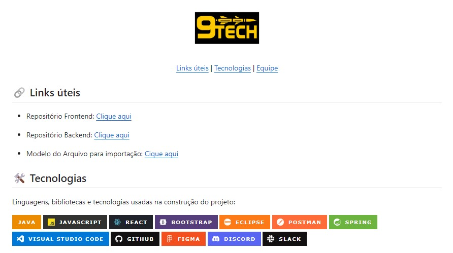

# IHC - Giuliano Bertoti
<h2>Repositório de Interação Humano Computador - Giuliano Bertoti</h2>

 

<h2>  IHC atual: o trabalho das heurísticas de usabilidade e acessibilidade avaliei formas convencionais de IHC: uma interação humano computador cujo fim é comprar um produto, marcar uma passagem, etc em uma interface gráfica convencional.</h2>

 

<break></break>

<h1> 10 pontos positivos encontrados<h1>

<h2>1° Lei: Visibilidade do Status do Sistema</h2>

  <h3>1 - Alura

   

  

   

  <h5>Um bom exemplo dessa heurística é observar um curso aqui na plataforma Alura. À esquerda há uma barra que mostra todo o conteúdo da palestra, mostra a palestra em andamento, registra o que você viu e permite voltar ou avançar. </h5>

---------------------------------------
<h2>2° Lei: Compatibilidade entre o sistema e o mundo real</h2>

  <h2>2 - Icons - Smartphone

   

  
  

   

  <h5>Os smartphones possuem muitos desses recursos, independentemente do sistema. Você já deve ter notado que aplicativos como “calculadora” ou “telefone”, apesar de terem uma aparência especial, resolvem diretamente uma finalidade física. Só de olhar o ícone, sem ler o nome do aplicativo, você já sabe diagnosticar perfeitamente o que ele é.</h5>

---------------------------------------
<h2>3° Lei: Controle e liberdade para o usuário</h2>

  <h2>3 - Lixeira

   

  
  

   

  <h5>Muitas vezes acabamos deletando algum arquivo por engano ou queremos recuperar o mesmo para devidos fins, para isso, precisaríamos de um botão de emergência para caso algo dê errado... com a lixeira, mesmo após apagarmos algum item, temos o controle e a liberdade de traze-lo de volta, diminuindo ou até mesmo anulando o impacto. </h5>

---------------------------------------
<h2>4° Lei: Consistência e Padronização</h2>

  <h2>4 - E-Mail - Outlook

   

  
  

   

  <h5>Note que todos os e-mails da estão aparecendo, possuem padrões visuais, permitindo que usuários dos seus produtos entendam e saibam utilizar facilmente a interface, conseguindo identificar e separar um do outro.</h5>

---------------------------------------
<h2>5° Lei: Prevenção de erros</h2>

  <h2>5 - Nubank

   

  
  

   

  <h5>Ao você digitar o "pix" da pessoa solicitada, além dele lhe dar sugestões, ele pode também lhe mostrar os que já foram feitos, estão salvos e depois a confirmação de dados .</h5>

---------------------------------------
<h2>6° Lei: Reconhecimento em vez de memorização</h2>

  <h2>6 - Mercado Livre

   

  
  

   

  <h5>Ao entrar em seu site, o sistema já reconhece sua conta e mostra as pesquisas relacionadas à ele, que ele pesquisou, lhe chamaram atenção, similares, ou até mesmo que têm algum relacionamento com qo que ele está comprando.</h5>

---------------------------------------
<h2>7° Lei: Eficiência e flexibilidade de uso</h2>

  <h2>7 - YouTube

   

  
  

   

  <h5>O YouTube é a plataforma que torna isso possível. Normalmente, você pode usar o cursor para clicar nos ícones "pausar" e "reproduzir" do vídeo e mover-se para frente e para trás na linha do tempo, mas também pode usar atalhos de teclado. Você pode usar as teclas "Espaço" ou "K" para pausar ou retomar o vídeo. Você também pode usar as teclas “Seta para a esquerda” e “Seta para a direita” para voltar 5 segundos, ou as teclas e "L" para avançar 10 segundos..</h5>

---------------------------------------

--------------------------
<h2>8° Lei: Estética e design minimalista</h2>

  <h2>8 - Netflix

   

  
  

   

  <h5>Informações sobre sua pesquisa, sem poluição, mostrando as capas dos filmes, alinhados e padronizados.</h5>

---------------------------------------

--------------------------
<h2>9° Lei: Ajude os usuários a reconhecerem, diagnosticarem e recuperarem-se de erros</h2>

  <h2>9 - Tela Login

   

  
  

   

  <h5>Em algum momento você poderá errar o login e/ou senha solicitado na plataforma, e o sistema retornará uma mensagem relatando o incidente. Os tipos de mensagens mostrados acima deste campo de formulário são os tipos mais comuns para esta heurística.</h5>

---------------------------------------

--------------------------
<h2>10° Lei: Ajuda e documentação</h2>

  <h2>10 - GitHub

   

  
  

   

  <h5>Finalizando os exemplos, muitas vezes, nos interessamos por algum projeto no github, mas não têm o modelo de como utiliza-lo, a documentação necessária, por isso, é bom disponibilizar para que outros também possam fazer os testes e dar dicas, sugestões e alguém de fora, mesmo que não entenda tanto, possa executar o projeto.</h5>

---------------------------------------

--------------------------